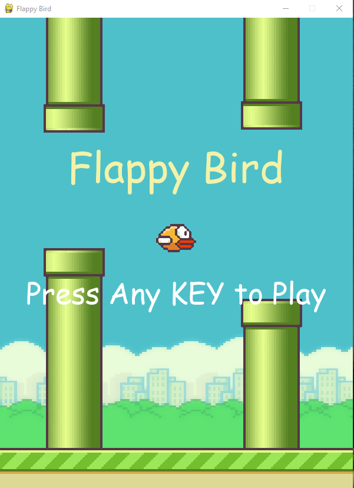
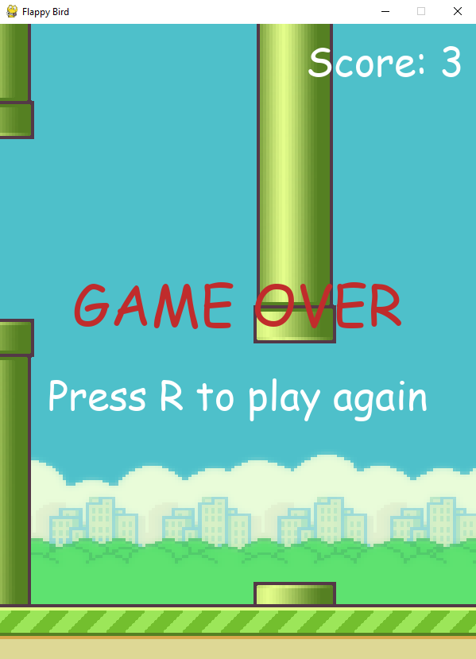

# Flappy Bird AI

Using NEAT Python to learn to play Flappy Bird. This code uses search and optimise technique called genetic algorithm which creates a particular number of random configurations, the best configuration of them is used to create the next generation of neural networks, as we repeat the process, with time, we observe that the performance gets better. 


## Usage

**How to play the game**

```sh
>> py game.py
```

- Use <kbd>&uarr;</kbd> or <kbd>w</kbd> key to play  
- Use <kbd>r</kbd> to retry the game.
- Use <kbd>spacebar</kbd> to pause the game.
- Use <kbd>ESC</kbd> to close the game.

<p align="left">
    
    
</p>

**How to train AI to play the game**

```sh
>> py train.py
```


**How to play the game with AI**

```sh
>> py main.py
```

### NEAT Python
Here is the documentation for the genetic module.  
**Check it out here:** [neat python](https://neat-python.readthedocs.io/en/latest/)

### Reference
Blog that explaining what's happening here.  
**Check it out here:** [medium blog](https://medium.com/chris-nielsen/teaching-an-ai-to-play-flappy-bird-f0b18d65569b)

### Tutorial
Tim at techwithtim teaching all the details of the project.  
**Check it out here:** [Tech with Tim](https://www.youtube.com/watch?v=OGHA-elMrxI)